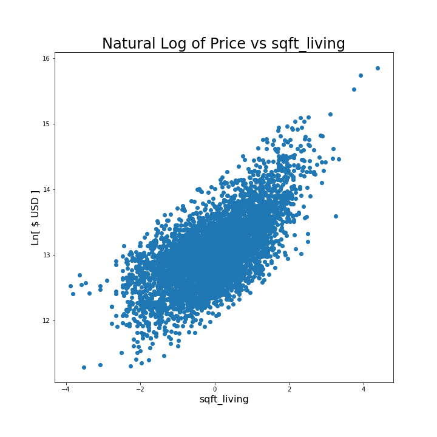
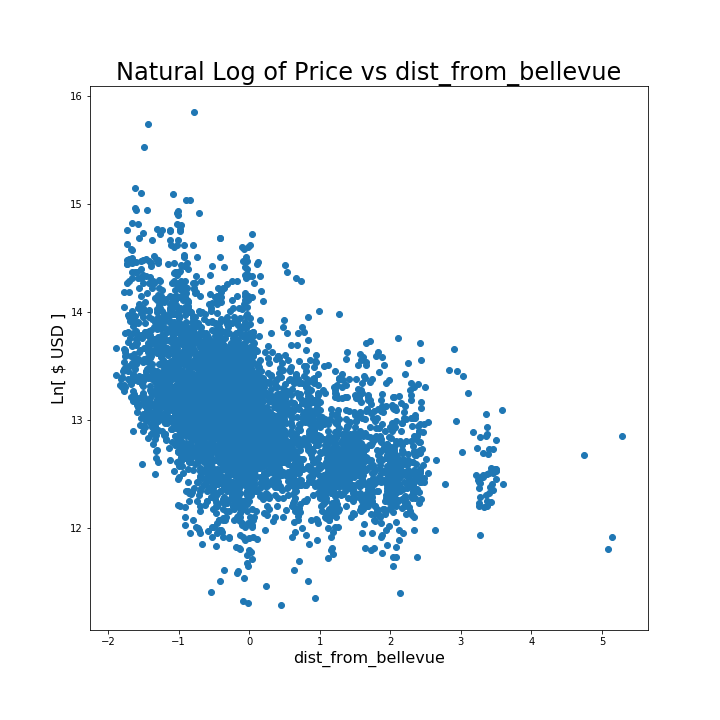
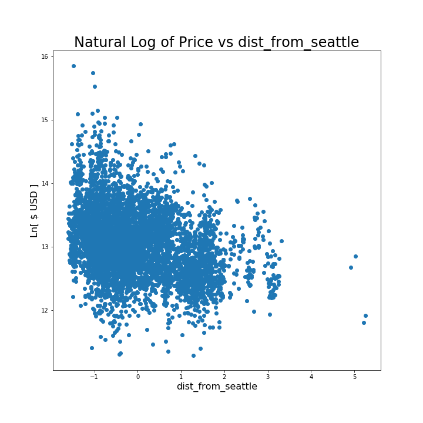
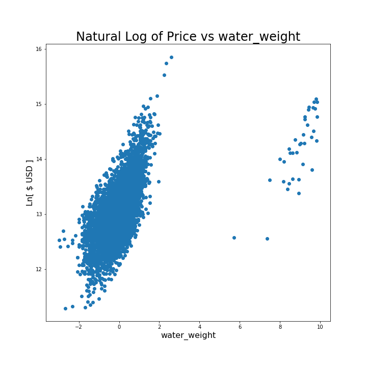
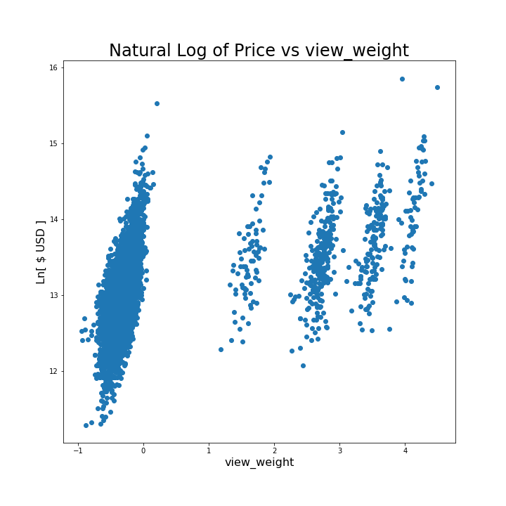

# iNKing: Buy, Buy, Buy

### Authors: 
#### Aaron Washington Chen [GitHub](https://github.com/AaronWChen)
#### Dirk Van Curan [GitHub](https://github.com/dirkstrong1)

## Executive Summary

This project aimed to make a price predictor based on real estate sales data in King County, WA from 2014-2015.

From the results, we recommend using the simplest model (linear regression) until more data can be collected. Using a more sophisticated model (LassoCV) did not improve the results and showed that it was underfitting the data. Having more information would allow for more complex models to perform better.

We can also see that factors with the most impact on price were living space square footage, distance from Bellevue (the most expensive region in the dataset), distance from Seattle, whether the property was on the waterfront, and the subjective quality of the view from the property.

## Project Information

This project uses partially processed King County Real Estate Sales data. It has been reduced to 1 year of sales and has been partially cleaned. This data is inside the `"kc_house_data.csv"` file in this repo.

The description of the column names can be found in the column_names.md file in this repository. As with most real world data sets, the column names are not perfectly described, so you'll have to do some research or use your best judgment if you have questions relating to what the data means.

This project was a good introduction to exploratory data analysis (EDA). The original deliverable used Jupyter Notebook files to perform all of the analysis, but these were refactored to Python 3 scripts with notebook files only used for presenting visualizations.

## Improvements and Next Steps

While it is possible to play with the data and try other, more complicated models on it, that does not seem to be a good use of time. Using LassoCV, while not complicated to implement, did not reveal any improvements in score or root mean square error (the two metrics used). 

Because the alpha coefficient for the LassoCV result was small (O(10^-4)), we believe that using a more complicated model would essentially give you back linear regression (the simplest model). Getting a larger dataset with more years of sales and more data columns would allow for more complex models to shine.

## Technical Discussion
### Key Questions
Can property be purchased within a short commuting distance from Bellevue?

How can companies based in Bellevue inform employees about possible residences in the area?

What effect does being on the waterfront have upon price?

### Approach
We work according to Cross-industry standard process for data mining (CRISP-DM) prinicples to make and improve our model.

Our approach to this model was to discover key variables that could help accurately determine sale price of a home in King County. Our first task was to see what sorts of questions we could answer to solve business problems with the raw data. Secondly, we cleaned the data, eliminated any features that did not help solve our business propositions and added any that gave better insight into what factors affected price. Once we had our initial model, we tweaked features to fit our model and proposed ways to augment the initial set of raw data. 

Our end goal was to minimize error, provide insights on what affected price, and develop a strategy around solving the business questions posed.

### Running the Code
If you are looking to run and/or work on this project yourself, you will need to:

1. Install Python 3 (I prefer and recommend Anaconda)

2. Clone [this repo](https://github.com/AaronWChen/Reducing-Error-on-King-County-Sales-Prices)

3. Install the packages in the requirements.txt file via pip (pip install -r requirements.txt from command line)

If you want to see the high level execution and results of the model, you can navigate to the python/ directory of this repo, open a Jupyter server there, and explore the noteoboks.

If you are looking to make changes to the code, I recommend using Visual Studio Code to open the files and edit, with Jupyter Notebook files for easy visualization of the dataframes.
